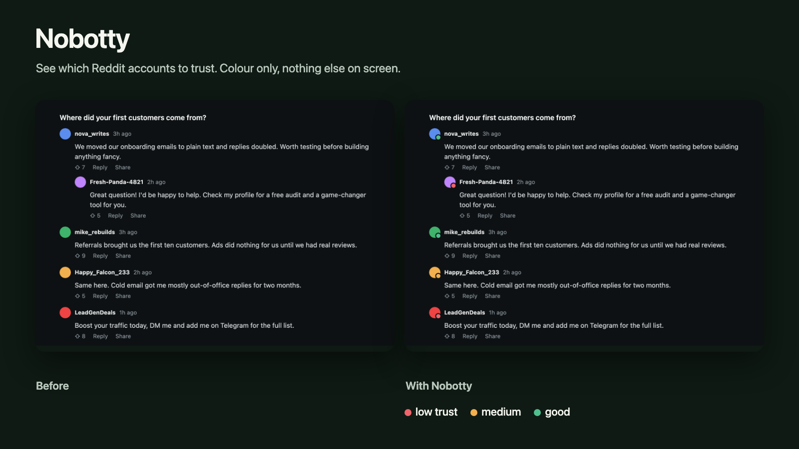

# Nobotty



*The screenshot uses a mock thread with fictional users.*

**Spot likely bots, scams and sales pitches on Reddit.** Nobotty is a small browser extension that puts a label on comments from very new or low-karma accounts, hides scam and bot direct messages, and lets you choose whether sales pitches are hidden too. One click opens anything it collapsed.

It gives signals, not proof. A new account can be a real person, so Nobotty only labels and collapses. It never deletes or blocks.

Everything runs in your browser. No tracking, no server, no accounts. See [PRIVACY.md](PRIVACY.md).

## What it does

- **A colour dot, no clutter.** Every checked account gets a small coloured dot at its avatar: **red** = low trust, **orange** = medium, **green** = good. No labels, no extra rows. Optional: a thin stripe instead of the dot, collapse red comments to one line, show the reason as a tooltip.
- **History check.** For suspicious accounts Nobotty also reads the account's last ~40 public posts and comments (locally, nothing is sent anywhere) and looks for bot patterns: shortened or link-hub URLs, the same link or text repeated, bursts of posts within minutes, spreading across many subreddits.
- **Direct messages:** hides scam and bot messages (crypto, "add me on Telegram", new accounts that send links). Sales pitches ("I can build your website", SEO offers, free audits) have their own switch.
- **Fast and polite:** four lookups in parallel, what you see first, and it spaces requests to stay inside Reddit's rate limit. Results are cached for 7 days.
- **Settings:** each colour can be turned off, collapse red comments, history check for every account, reasons on hover, DM filter and the sales-pitch switch, trusted accounts that are never marked.

## Install

### Chrome, Edge, Brave
1. Download this repository (Code, then Download ZIP) and unzip it.
2. Open `chrome://extensions` and turn on Developer mode.
3. Click Load unpacked and choose the unzipped folder.

### Firefox
Open `about:debugging#/runtime/this-firefox`, click Load Temporary Add-on and choose `manifest.json`.

### Safari (no Xcode needed): userscript
Safari cannot load an extension folder, but it runs userscripts through a free app.
1. Install **Userscripts** from the Mac App Store (free, open source) and enable it in Safari Settings, Extensions. Choose a folder for your scripts when it asks.
2. Copy [`userscript/nobotty.user.js`](userscript/nobotty.user.js) into that folder.
3. Open Reddit. A small **Nobotty** button appears at the bottom left. It opens the settings (turn on, collapse strong signals, direct message filter, hide bots and scams, **hide sales pitches too**, trusted accounts).

The userscript build has the same detection as the extension. It was tested against a mock inbox, not live Reddit.

### Safari as a full extension (needs Xcode)
Install Xcode, then run `xcrun safari-web-extension-converter /path/to/nobotty`, build and run the generated app and enable it in Safari Settings, Extensions (during development also Develop, Allow Unsigned Extensions). Shipping it on the App Store needs an Apple developer account.

## How it decides

Comments: account age and karma (Reddit's public `about.json`), auto-style usernames, identical text from two accounts, stock phrases, and (for suspicious accounts) the posting history described above. Points add up: 5 or more is red, 3 or 4 is orange, 0 or 1 with a known account is green. Direct messages: scam patterns, sales-pitch patterns and new accounts that send links. The patterns are plain regular expressions in `content.js`, so you can read and change them.

## Known limits

- It cannot know who is a bot. Expect false positives and misses.
- Reddit changes its page markup often. The selectors are in one place (`SEL` and `DM_SEL` in `content.js`). The new chat interface is not verified yet. Please open an issue with the page's HTML if a selector stops working.
- Tested against a local fixture, not yet against live Reddit at scale.

## Tests

```
npm install
npx playwright install chromium
npm test
npm run build   # regenerates userscript/nobotty.user.js
```

The tests load the content script into a mock comment page and a mock inbox and check which items get labelled.

## Contributing

Issues and pull requests are welcome, especially new patterns, selector fixes and translations of the popup.

## License

MIT, see [LICENSE](LICENSE).
